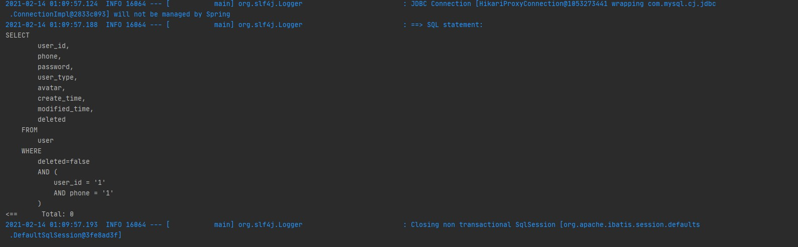
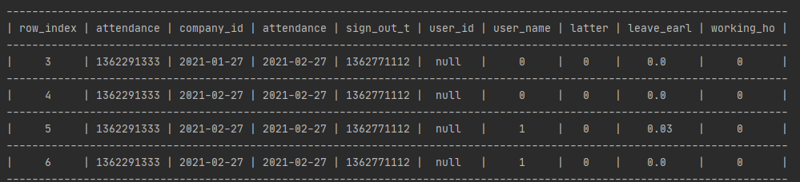

# 基本描述
- MyBatis的日志类的一个实现，增加了基础的参数替换功能。
- 将查询结果以表格的形式输出（中英文对齐）。

# 效果

# 注意

1. 输出的级别为INFO级别
2. 默认不输出结果集
3. 当使用非等宽字体的时候，可能会导致含有中文行的和不含有中文行的对不齐，切换到等宽字体下，显示正常

# 使用

## 输出结果集

配置文件中增加如下配置

~~~properties
# 输出结果
top.wmgx.mybatisLogPlus.enableShowResult=true
# 每列最大宽度（默认10）
top.wmgx.mybatisLogPlus.maxWidth=10
# 显示前n条记录（默认30）
top.wmgx.mybatisLogPlus.topLine=30
# 显示前n列（默认9）
top.wmgx.mybatisLogPlus.topColumn=9
~~~

使用方法一要在启动类上加入`@MybatisLogPlusAutoConfig`注解

使用方法二不用可以直接使用。

## 方法一

1. 将target目录下的jar包放到项目目录下
2. 在pom文件中引入
~~~xml
    <dependency>
            <groupId>top.wmgx</groupId>
            <artifactId>MybatisLogPlus</artifactId>
            <version>1.4</version>
            <scope>system</scope>
            <systemPath>${project.basedir}/{存放的项目下的目录}/MybatisPlusLogPlus-1.4.jar</systemPath>
        </dependency>
~~~
3. 配置文件
~~~properties
# mybatis 配置
mybatis.configuration.log-impl=top.wmgx.MybatisLogPlus
# mybatis -plus 配置
mybatis-plus.configuration.log-impl=top.wmgx.MybatisLogPlus
~~~
## 方法二

- MybatisLogPlus.java直接拷贝到项目中，配置文件中写这个类的路径即可
- 代码很简单，自行修改即可。
- SqlFormatter为Hutool的工具类，可以不用，目的是输出美观的sql。
- 为方便拷贝，将所有的代码都在一个类中写了。

> 表格输出的代码改自 https://github.com/Yanqin25/jdbcConnectTool.git